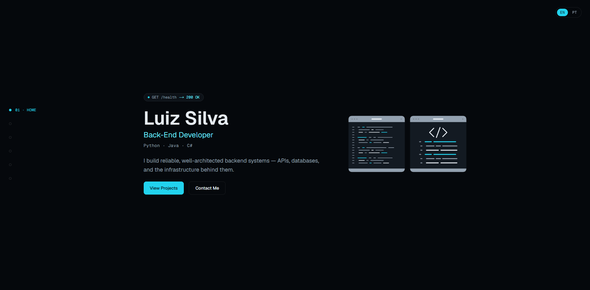

# Luiz Silva — Portfólio

Portfólio pessoal de um **Desenvolvedor Back-End**. Site de página única, renderizado estaticamente com o App Router do Next.js, com foco em qualidade visual, performance, acessibilidade e SEO.

**🔗 Acesse: [luizsoc.vercel.app](https://luizsoc.vercel.app/)**



## Funcionalidades

- **Layout de página única** com as seções Início, Sobre, Experiência, Projetos, Skills e Contato
- **Bilíngue (EN / PT-BR)**: troca de idioma no cliente, preferência salva no `localStorage` e `<html lang>` sincronizado
- **Navegação responsiva**: menu lateral fixo no desktop, menu recolhível no mobile e destaque da seção ativa
- **Acessível por padrão**: HTML semântico, skip link, foco visível, navegação por teclado e suporte a `prefers-reduced-motion`
- **Design dark-only** com tokens definidos em CSS via `@theme` do Tailwind v4
- **Vercel Analytics** e **Speed Insights** integrados

## Tecnologias

| Área | Ferramentas |
| --- | --- |
| Framework | [Next.js 16](https://nextjs.org) (App Router), [React 19](https://react.dev) |
| Linguagem | TypeScript (modo strict) |
| Estilização | [Tailwind CSS v4](https://tailwindcss.com) (configuração CSS-first) |
| Animação | [Motion](https://motion.dev) |
| Ícones | [Lucide](https://lucide.dev) |
| Fontes | Geist via `next/font` |
| Hospedagem | [Vercel](https://vercel.com) |

## Como rodar localmente

Requer Node.js 20.9 ou superior.

```bash
git clone https://github.com/luizsoc/portfolio.git
cd portfolio
npm install
npm run dev
```

Abra [http://localhost:3000](http://localhost:3000).

### Scripts

| Comando | Descrição |
| --- | --- |
| `npm run dev` | Inicia o servidor de desenvolvimento |
| `npm run build` | Gera o build de produção |
| `npm run start` | Serve o build de produção |
| `npm run lint` | Executa o ESLint |

## Estrutura do projeto

```
app/
  layout.tsx            # Layout raiz: fontes, metadata, navegação, providers
  page.tsx              # Página inicial composta pelas seções
  globals.css           # Tailwind v4 + design tokens
  components/
    ui/                 # Primitivos reutilizáveis (Button, Badge, Card, Container...)
    layout/             # SideNav, MobileNav, Footer
    sections/           # Hero, About, Experience, Projects, Skills, Contact
    providers/          # LanguageProvider (contexto de i18n)
  lib/
    content/            # Dados do portfólio: perfil, projetos, skills, experiência
    i18n/dictionaries/  # Textos da interface em inglês e português
  types/                # Tipos TypeScript compartilhados
```

## Editando o conteúdo

O conteúdo fica separado dos componentes, então dá para atualizar o portfólio sem mexer em JSX:

- **Dados que não mudam com o idioma** (nome, links, tecnologias, repositórios dos projetos) ficam em `app/lib/content/*.ts`.
- **Textos traduzíveis** (títulos, descrições, labels) ficam em `app/lib/i18n/dictionaries/en.ts` e `pt.ts`. Os dois são tipados por `Dictionary`, então uma tradução faltando gera erro de tipo.

Para adicionar um projeto, inclua uma entrada em `PROJECTS` no arquivo `app/lib/content/projects.ts` e a descrição dele nos dois dicionários.

## Deploy

Hospedado na Vercel com integração ao Git: cada push na branch `master` gera um deploy de produção, e outras branches e pull requests ganham URLs de preview. Nenhuma variável de ambiente é necessária.

## Contato

- GitHub: [@luizsoc](https://github.com/luizsoc)
- LinkedIn: [luizsoc](https://www.linkedin.com/in/luizsoc/)
- E-mail: luizsoc123@gmail.com
